# VidaPlena – Sistema de Gestão de Clínica Multidisciplinar

> Projeto de Disciplina – Programação Orientada a Objetos (AV2)  

---

## Descrição do Sistema

O **VidaPlena** é um sistema de gestão para clínicas multidisciplinares, desenvolvido em Java com foco na aplicação prática dos conceitos de Programação Orientada a Objetos. O sistema opera via terminal (console) e permite gerenciar pacientes, profissionais de saúde, consultas, atendimentos e pagamentos em uma única aplicação.

O projeto foi construído como evolução da Etapa AV1, incorporando os seguintes pilares de POO:

- Encapsulamento e modificadores de acesso com critério
- Herança com hierarquia de 3 níveis (`Pessoa` → `Profissional` → especializações)
- Classes abstratas e interfaces
- Sobrecarga e sobrescrita de métodos
- Ligação dinâmica (polimorfismo em tempo de execução)
- Tratamento de exceções personalizadas
- Relacionamentos de Associação, Agregação e Composição
- Coleções Java (`List`, `Set`, `Map`) com escolha justificada

---

## Funcionalidades

### Pacientes
- **Cadastro simplificado** – registra apenas nome e CPF para agilizar o atendimento inicial.
- **Cadastro completo** – adiciona idade, telefone e convênio de uma só vez.
- **Complementação de cadastro** – permite enriquecer um cadastro mínimo posteriormente.
- **Busca por CPF** – localiza o paciente em O(1) via `HashMap`.
- **Listagem geral** – exibe todos os pacientes cadastrados.
- **Desativação** – marca o paciente como inativo, impedindo novos agendamentos.
- **Controle de duplicidade** – CPF é validado por um `HashSet`, garantindo unicidade.

### Profissionais
- **Cadastro em 3 níveis de detalhe** – mínimo (nome + especialidade), intermediário (+ registro e valor) e completo (+ dias de atendimento).
- **Atualização de cadastro** – permite alterar registro, valor e dias de atendimento.
- **Listagem geral e por especialidade** – filtra Clínico Geral, Fisioterapeuta, Nutricionista ou Psicólogo.
- Especialidades suportadas: `clinica geral`, `fisioterapia`, `psicologia`, `nutricao`.

### Consultas
- **Agendamento por profissional específico** – busca pelo nome e verifica disponibilidade de dia/horário e conflito de agenda.
- **Agendamento por especialidade** – o sistema seleciona automaticamente o primeiro profissional disponível na especialidade informada.
- **Cancelamento** – com ou sem motivo; aplica multa de R$ 50,00 se o cancelamento ocorrer com menos de 2 horas de antecedência.
- **Remarcação** – cancela a consulta original e cria uma nova no horário informado.
- **Listagem geral** – exibe todas as consultas com índice, status e detalhes.
- **Busca por CPF do paciente** – filtra o histórico de consultas de um paciente.
- **Sugestão de horário** – quando o agendamento falha, o sistema oferece o próximo horário livre no mesmo dia (08h–21h).

### Atendimentos
- **Registro de atendimento** – vincula o atendimento a uma consulta agendada por índice.
- Três níveis de registro: apenas observações, observações + diagnóstico, ou completo com procedimentos.
- O registro de procedimentos pode ser feito um a um ou em lote.
- Cada especialidade adiciona automaticamente informações específicas ao atendimento (ex.: sessões restantes para fisioterapia, plano alimentar para nutrição).

### Pagamentos
- **Pagamento direto** – informa o valor manualmente; aceita `dinheiro` ou `cartao`.
- **Pagamento automático** – lê o valor da consulta cadastrado no profissional; aceita `dinheiro`, `cartao` e `convenio`.
- Convênios disponíveis: `SaudePlus` (40%), `VidaMais` (30%) e `BemEstar` (50%).
- Parcelamento em cartão: de 1 a 6 parcelas (acima disso, exceção é lançada).
- Multas pendentes podem ser incluídas no valor final do pagamento.
- **Listagem de pagamentos** – exibe todos os pagamentos com valor final e parcelas.

### Relatórios

| Opção | Descrição |
|-------|-----------|
| Geral | Todas as consultas com diagnósticos registrados |
| Por profissional | Consultas filtradas pelo nome do profissional |
| Por período | Consultas em um intervalo de datas (DD/MM/AAAA) |
| Resumo financeiro | Total faturado, multas e valor por tipo de pagamento |
| Cancelamentos | Consultas canceladas com motivos |
| Multas aplicadas | Histórico de multas por cancelamento tardio |
| Relatório de pagamentos | Todos os pagamentos com detalhes |
| Relatório unificado de pessoas | Lista polimórfica de pacientes e profissionais com tipo real |
| Exportar dados operacionais | Exporta consultas, atendimentos e pagamentos em formato CSV simples |

---

## Estrutura do Projeto

```
ProjetoPOO-Etapa02/
├── docs/
│   ├── Projeto de Disciplina - Descrito Etapa AV2.pdf
│   ├── Projeto de Disciplina - Jornadas de Usuário.pdf
│   └── Projeto de Disciplina - Roteiro de Refatoração.pdf
└── src/
    └── br/com/clinicaVidaPlena/
        ├── Main.java
        ├── Exceptions/
        │   ├── ConsultaNaoEncontradaException.java
        │   ├── ConsultaJaRealizadaException.java
        │   ├── ConvenioNaoCobreException.java
        │   ├── EspecialidadeInvalidaException.java
        │   ├── HorarioIndisponivelException.java
        │   ├── HorarioOcupadoException.java
        │   ├── OperacaoInvalidaException.java
        │   ├── PacienteInativoException.java
        │   ├── PacienteNaoEncontradoException.java
        │   ├── PagamentoInvalidoException.java
        │   ├── ProfissionalNaoEncontradoException.java
        │   └── ValorInvalidoException.java
        └── model/
            ├── Agendavel.java          (interface)
            ├── Exportavel.java         (interface)
            ├── Atendimento.java
            ├── Consulta.java
            ├── Convenio.java
            ├── HorarioDisponivel.java
            ├── Prontuario.java
            ├── Relatorio.java
            ├── pagamento/
            │   ├── Pagamento.java      (abstrata)
            │   ├── PagamentoCartao.java
            │   ├── PagamentoConvenio.java
            │   └── PagamentoDinheiro.java
            └── pessoa/
                ├── Pessoa.java         (abstrata)
                ├── Paciente.java
                ├── Profissional.java   (abstrata)
                ├── ClinicoGeral.java
                ├── Fisioterapeuta.java
                ├── Nutricionista.java
                └── Psicologo.java
```

---

## Compilação e Execução

### Pré-requisitos

- **Java JDK 11+** instalado e configurado no `PATH`.
- Sem dependências externas — o projeto usa apenas a biblioteca padrão do Java.

### Passos

**1. Acesse a pasta raiz do projeto:**
```bash
cd ProjetoPOO-Etapa02
```

**2. Compile todo o código-fonte:**
```bash
javac -d out -sourcepath src src/br/com/clinicaVidaPlena/Main.java
```
> O diretório `out/` será criado automaticamente com os arquivos `.class`.

**3. Execute a aplicação:**
```bash
java -cp out br.com.clinicaVidaPlena.Main
```

O menu principal será exibido no terminal.

---

## Como Usar o Sistema

O sistema opera via menus numerados no terminal. Digite o número da opção desejada e pressione **Enter**.

### Fluxo básico recomendado

```
1. Cadastrar um paciente        → Menu 1 → Opção 1
2. Cadastrar um profissional    → Menu 2 → Opção 1
3. Agendar uma consulta         → Menu 3 → Opção 1
4. Registrar o atendimento      → Menu 4 → Opção 1
5. Registrar o pagamento        → Menu 5 → Opção 2 (automático)
6. Gerar relatório              → Menu 6 → Opção 4 (resumo financeiro)
```

### Formatos de entrada aceitos

| Campo | Formato |
|-------|---------|
| Data | `DD/MM/AAAA` — ex.: `28/06/2026` |
| Horário | `HH:MM` — ex.: `09:00` |
| Especialidade | `clinica geral`, `fisioterapia`, `psicologia`, `nutricao` |
| Dias da semana | `segunda`, `terca`, `quarta`, `quinta`, `sexta`, `sabado`, `domingo` |
| Tipo de consulta | `inicial`, `retorno`, `avaliacao` |
| Tipo de pagamento | `dinheiro`, `cartao`, `convenio` |

### Convênios disponíveis

| Nome | Cobertura |
|------|-----------|
| SaudePlus | 40% |
| VidaMais | 30% |
| BemEstar | 50% |

As especialidades cobertas por cada convênio são definidas no momento do cadastro do paciente.

---

## Diagrama de Classes

```mermaid
classDiagram
    direction TB

    %% ─────────────────────────────────────────
    %% INTERFACES
    %% ─────────────────────────────────────────

    class Agendavel {
        <<interface>>
        +agendar() void
        +cancelar() void
        +remarcar() void
    }

    class Exportavel {
        <<interface>>
        +exportarDados() String
    }

    %% ─────────────────────────────────────────
    %% HIERARQUIA DE PESSOA
    %% ─────────────────────────────────────────

    class Pessoa {
        <<abstract>>
        #nome : String
        #cpf : String
        #telefone : String
        #dataNascimento : LocalDate
        +getNome() String
        +getCpf() String
        +getTelefone() String
        +setCpf(cpf) void
        +setTelefone(telefone) void
        +calcularIdade() int
        +exibirResumo()* String
    }

    class Paciente {
        -idade : int
        -ativo : boolean
        +Paciente(nome, cpf)
        +Paciente(nome, cpf, idade, telefone)
        +Paciente(nome, cpf, idade, telefone, convenio)
        +complementar(idade, telefone) void
        +complementar(idade, telefone, convenio) void
        +desativar() void
        +isAtivo() boolean
        +getIdade() int
        +getConvenio() Convenio
        +exibirResumo() String
    }

    class Profissional {
        <<abstract>>
        #especialidade : String
        #registroProfissional : String
        #valorConsulta : double
        -horariosDisponiveis : List~HorarioDisponivel~
        +Profissional(nome, especialidade)
        +Profissional(nome, especialidade, registro, valor)
        +Profissional(nome, especialidade, registro, valor, dias, totalDias)
        +getEspecialidade() String
        +getValorConsulta() double
        +atualizar(registro, valor) void
        +atualizar(registro, valor, dias, totalDias) void
        +atendeNoDia(dia) boolean
        +atendeNoHorario(dia, horario) boolean
        +adicionarHorario(horario) void
        +removerHorario(horario) void
        +registrarEspecifico(atendimento)* void
        +exibirResumo() String
        #validarRegistro() boolean
        +especialidadeValida(esp)$ boolean
        +reatribuirHorario(origem, destino, horario)$ void
    }

    class Fisioterapeuta {
        -totalSessoesPrevistas : int
        +Fisioterapeuta(nome)
        +Fisioterapeuta(nome, registro, valor)
        +Fisioterapeuta(nome, registro, valor, dias, totalDias)
        +registrarSessao() void
        +registrarEspecifico(atendimento) void
        +exibirResumo() String
    }

    class Psicologo {
        -abordagem : String
        +Psicologo(nome)
        +Psicologo(nome, registro, valor)
        +Psicologo(nome, registro, valor, dias, totalDias)
        +definirAbordagem(abordagem) void
        +registrarEspecifico(atendimento) void
        +exibirResumo() String
    }

    class Nutricionista {
        -planoAlimentar : String
        +Nutricionista(nome)
        +Nutricionista(nome, registro, valor)
        +Nutricionista(nome, registro, valor, dias, totalDias)
        +registrarPlanoAlimentar(plano) void
        +registrarEspecifico(atendimento) void
        +exibirResumo() String
    }

    class ClinicoGeral {
        -encaminhamento : String
        +ClinicoGeral(nome)
        +ClinicoGeral(nome, registro, valor)
        +ClinicoGeral(nome, registro, valor, dias, totalDias)
        +registrarEncaminhamento(encaminhamento) void
        +registrarEspecifico(atendimento) void
        +exibirResumo() String
    }

    %% ─────────────────────────────────────────
    %% HIERARQUIA DE PAGAMENTO
    %% ─────────────────────────────────────────

    class Pagamento {
        <<abstract>>
        -indiceConsulta : int
        #valorBase : double
        #valorFinal : double
        -tipoPagamento : String
        #parcelas : int
        #multa : double
        +getValorFinal() double
        +setValorFinal(valor) void
        +getTipoPagamento() String
        +getParcelas() int
        +getIndiceConsulta() int
        +calcularValorFinal()* double
        #arredondar(valor) double
        +exibirResumo() String
        +exportarDados() String
    }

    class PagamentoDinheiro {
        -DESCONTO_FIXO : double = 0.05
        +PagamentoDinheiro(indiceConsulta, valorBase)
        +PagamentoDinheiro(indiceConsulta, valorBase, multa)
        +calcularValorFinal() double
        +exportarDados() String
    }

    class PagamentoCartao {
        -MAXIMO_PARCELAS : int = 6
        -TAXA_POR_PARCELA_EXTRA : double = 0.025
        +PagamentoCartao(indiceConsulta, valorBase, parcelas)
        +PagamentoCartao(indiceConsulta, valorBase, parcelas, multa)
        +calcularValorFinal() double
        +exportarDados() String
    }

    class PagamentoConvenio {
        -convenio : Convenio
        -especialidade : String
        +PagamentoConvenio(indiceConsulta, valorBase, convenio, especialidade)
        +PagamentoConvenio(indiceConsulta, valorBase, convenio, especialidade, multa)
        +calcularValorFinal() double
        +exibirResumo() String
        +exportarDados() String
    }

    %% ─────────────────────────────────────────
    %% ENTIDADES DE NEGÓCIO
    %% ─────────────────────────────────────────

    class Consulta {
        -cpfPaciente : String
        #nomeProfissional : String
        #data : String
        -horario : String
        -tipo : String
        #status : String
        +Consulta(cpf, prof, data, horario)
        +Consulta(cpf, prof, data, horario, tipo)
        +Consulta(cpf, prof, data, horario, tipo, status)
        +agendar() void
        +cancelar() void
        +cancelar(motivo) String
        +remarcar() void
        +realizar() void
        +exibirResumo() String
        +exportarDados() String
    }

    class Atendimento {
        -indiceConsulta : int
        +Atendimento(indiceConsulta, observacoes)
        +Atendimento(indiceConsulta, observacoes, diagnostico)
        +Atendimento(indiceConsulta, observacoes, diagnostico, procedimentos, total)
        +adicionarProcedimento(procedimento) void
        +adicionarProcedimento(procs, quantidade) void
        +getDiagnostico() String
        +getIndiceConsulta() int
        +exibirResumo() String
        +exportarDados() String
    }

    class Prontuario {
        -observacoes : String
        -diagnostico : String
        -procedimentosRealizados : List~String~
        -dataRegistro : LocalDate
        ~Prontuario(observacoes, diagnostico)
        +adicionarProcedimento(procedimento) void
        +adicionarProcedimentos(procs, quantidade) void
        +getObservacoes() String
        +getDiagnostico() String
        +getProcedimentosRealizados() List
        +getDataRegistro() LocalDate
    }

    class Convenio {
        -nome : String
        -percentualCobertura : double
        -especialidadesCobertas : List~String~
        +Convenio(nome, percentualCobertura)
        +adicionarEspecialidade(especialidade) void
        +cobreEspecialidade(especialidade) boolean
        +getNome() String
        +getPercentualCobertura() double
    }

    class HorarioDisponivel {
        -diaDaSemana : String
        -turno : String
        +HorarioDisponivel(diaDaSemana, turno)
        +getDiaDaSemana() String
        +getTurno() String
        +equals(obj) boolean
        +hashCode() int
    }

    class Relatorio {
        +gerarRelatorio(consultas, atendimentos)$ void
        +gerarRelatorio(consultas, atendimentos, nomeProfissional)$ void
        +gerarRelatorio(consultas, atendimentos, dataInicio, dataFim)$ void
        +gerarResumoFinanceiro(consultas, pagamentos, multas)$ void
        +gerarRelatorioCancelamentos(consultas)$ void
        +gerarRelatorioMultasAplicadas(multas)$ void
        +gerarRelatorioPagamentos(pagamentos)$ void
        +buscarDiagnostico(indice, atendimentos)$ String
        +estaNoIntervalo(data, inicio, fim)$ boolean
    }

    %% ─────────────────────────────────────────
    %% EXCEÇÕES
    %% ─────────────────────────────────────────

    class RuntimeException {
        <<JDK>>
    }

    class PacienteNaoEncontradoException {
        +PacienteNaoEncontradoException(mensagem)
        +PacienteNaoEncontradoException(mensagem, causa)
    }

    class PacienteInativoException {
        +PacienteInativoException(mensagem)
        +PacienteInativoException(mensagem, causa)
    }

    class ProfissionalNaoEncontradoException {
        +ProfissionalNaoEncontradoException(mensagem)
        +ProfissionalNaoEncontradoException(mensagem, causa)
    }

    class HorarioIndisponivelException {
        +HorarioIndisponivelException(mensagem)
        +HorarioIndisponivelException(mensagem, causa)
    }

    class ConsultaNaoEncontradaException {
        +ConsultaNaoEncontradaException(mensagem)
        +ConsultaNaoEncontradaException(mensagem, causa)
    }

    class OperacaoInvalidaException {
        +OperacaoInvalidaException(mensagem)
        +OperacaoInvalidaException(mensagem, causa)
    }

    class PagamentoInvalidoException {
        +PagamentoInvalidoException(mensagem)
        +PagamentoInvalidoException(mensagem, causa)
    }

    class ConvenioNaoCobreException {
        +ConvenioNaoCobreException(mensagem)
        +ConvenioNaoCobreException(mensagem, causa)
    }

    class ValorInvalidoException {
        +ValorInvalidoException(mensagem)
        +ValorInvalidoException(mensagem, causa)
    }

    class EspecialidadeInvalidaException {
        +EspecialidadeInvalidaException(mensagem)
        +EspecialidadeInvalidaException(mensagem, causa)
    }

    %% ─────────────────────────────────────────
    %% HERANÇA — PESSOA
    %% ─────────────────────────────────────────
    Pessoa <|-- Paciente
    Pessoa <|-- Profissional
    Profissional <|-- Fisioterapeuta
    Profissional <|-- Psicologo
    Profissional <|-- Nutricionista
    Profissional <|-- ClinicoGeral

    %% ─────────────────────────────────────────
    %% HERANÇA — PAGAMENTO
    %% ─────────────────────────────────────────
    Pagamento <|-- PagamentoDinheiro
    Pagamento <|-- PagamentoCartao
    Pagamento <|-- PagamentoConvenio

    %% ─────────────────────────────────────────
    %% HERANÇA — EXCEÇÕES
    %% ─────────────────────────────────────────
    RuntimeException <|-- PacienteNaoEncontradoException
    RuntimeException <|-- PacienteInativoException
    RuntimeException <|-- ProfissionalNaoEncontradoException
    RuntimeException <|-- HorarioIndisponivelException
    RuntimeException <|-- ConsultaNaoEncontradaException
    RuntimeException <|-- OperacaoInvalidaException
    RuntimeException <|-- PagamentoInvalidoException
    RuntimeException <|-- ConvenioNaoCobreException
    RuntimeException <|-- ValorInvalidoException
    RuntimeException <|-- EspecialidadeInvalidaException

    %% ─────────────────────────────────────────
    %% IMPLEMENTAÇÕES DE INTERFACE
    %% ─────────────────────────────────────────
    Agendavel <|.. Consulta
    Exportavel <|.. Consulta
    Exportavel <|.. Atendimento
    Exportavel <|.. Pagamento

    %% ─────────────────────────────────────────
    %% RELACIONAMENTOS
    %% ─────────────────────────────────────────

    %% ASSOCIAÇÃO: Paciente conhece Convenio (ambos existem independentemente)
    Paciente --> Convenio : associação

    %% AGREGAÇÃO: Profissional possui HorarioDisponivel (horários sobrevivem ao profissional)
    Profissional o-- HorarioDisponivel : agregação

    %% COMPOSIÇÃO: Atendimento contém Prontuario (prontuário não existe sem o atendimento)
    Atendimento *-- Prontuario : composição

    %% ASSOCIAÇÃO: PagamentoConvenio usa Convenio para calcular cobertura
    PagamentoConvenio --> Convenio : usa
```



---

## Exceções Personalizadas

Todas as exceções estendem `RuntimeException` e possuem dois construtores (mensagem simples e mensagem + causa):

| Exceção | Quando é lançada |
|---------|-----------------|
| `PacienteNaoEncontradoException` | CPF não encontrado no sistema |
| `PacienteInativoException` | Tentativa de agendar para paciente desativado |
| `ProfissionalNaoEncontradoException` | Nome do profissional não localizado |
| `ValorInvalidoException` | Profissional sem valor de consulta definido (≤ 0) |
| `HorarioIndisponivelException` | Horário já ocupado ou dia não atendido pelo profissional |
| `HorarioOcupadoException` | Conflito de agenda detectado |
| `EspecialidadeInvalidaException` | Especialidade fora das opções válidas |
| `OperacaoInvalidaException` | Tentativa de cancelar/atender consulta já realizada ou cancelada |
| `PagamentoInvalidoException` | Tipo inválido ou parcelas fora do intervalo 1–6 |
| `ConvenioNaoCobreException` | Especialidade da consulta não coberta pelo convênio do paciente |
| `ConsultaNaoEncontradaException` | Busca por CPF + data + horário sem resultado |
| `ConsultaJaRealizadaException` | Tentativa de remarcar consulta já realizada |

---

## Decisões de Projeto

### Coleções utilizadas

| Estrutura | Uso | Justificativa |
|-----------|-----|---------------|
| `ArrayList<Paciente>` | Lista de pacientes | Ordem de inserção preservada; acesso por índice necessário |
| `ArrayList<Profissional>` | Lista de profissionais | Mesmo motivo |
| `HashSet<String>` | CPFs cadastrados | Verificação de existência em O(1); duplicatas descartadas automaticamente |
| `HashMap<String, Paciente>` | Busca por CPF | Acesso direto por chave; O(1) vs O(n) de percorrer a lista |
| `HashMap<String, Profissional>` | Busca por nome do profissional | Mesmo motivo |
| `List<Pagamento>` | Histórico de pagamentos | Lista polimórfica — qualquer subclasse de `Pagamento` é armazenada |
| `List<Pessoa>` | Relatório unificado | Permite iterar pacientes e profissionais com ligação dinâmica em `exibirResumo()` |

### Relacionamentos implementados

- **Associação** — `Paciente` conhece `Convenio`; ambos existem de forma independente.
- **Agregação** — `Profissional` possui lista de `HorarioDisponivel`; os horários podem existir sem o profissional.
- **Composição** — `Atendimento` contém `Prontuario`; o prontuário é criado dentro do atendimento e não existe de forma independente.

---

## Equipe

Projeto desenvolvido por equipe de estudantes da disciplina de Programação Orientada a Objetos.

Branches de desenvolvimento individuais: `dev/mariana`, `dev/matheus`, `dev/rodrigo`, `dev/uirá`, `dev/victor`, `dev/william`, `dev/ninaa`
